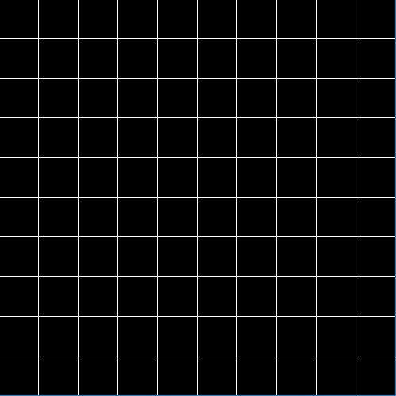
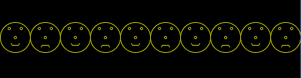
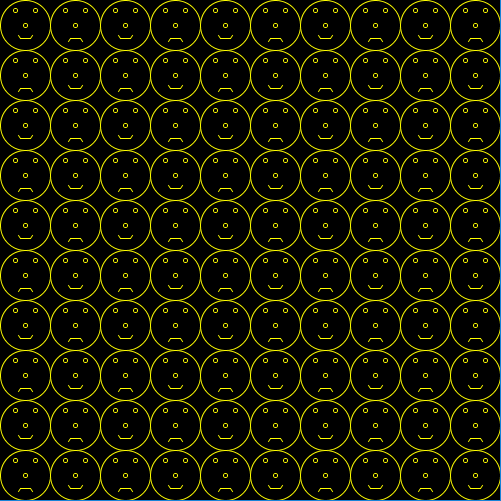

# DT508 Game Programming

Resources
---------
* [Assignments](assignment.md)
* [Webcourses](http://dit.ie/webcourses)
* [Slack](https://dt508-gameprogramming.slack.com/)
* [Processing](http://processing.org)
* [The Processing language reference](http://processing.org/reference/)
* [Learning Processing: A Beginner's Guide to Programming Images, Animation, and Interaction (Morgan Kaufmann Series in Computer Graphics)](http://http://www.learningprocessing.com/)
* [The Nature of Code](http://natureofcode.com/)
* [The git manual - read the first three chapters](http://git-scm.com/documentation)
* [A video tutorial all about git/github](https://www.youtube.com/watch?v=p_PGUltnB6w)
* [Games Fleadh](http://www.gamesfleadh.ie/)
* [The Imagine Cup](https://www.imaginecup.com/)

## Contact the lecturer
Email: bryan.duggan@dit.ie
Twitter: [@skooter500](http://twitter.com/skooter500)
Slack: https://dt508-gameprogramming.slack.com/

# Week 1
## Lecture
- [Introduction slides](https://onedrive.live.com/redir?resid=AB603D769EDBF24E!263972&authkey=!AK1asYNZOHgqEC0&ithint=file%2cpptx)
- [The program we wrote in class](processing/intro/intro.pde)
- [The contract for this course](http://1drv.ms/1DbmnG9)
- Procedurally generated minnowforms video:
	[](https://www.youtube.com/watch?v=5G-PKD5GnlE)

- NILL - One of my game jam games. It uses lots of nice come sci stuff like Perlin noise, procedural generation and binary search

	[](https://www.youtube.com/watch?v=RkReFavQbQo)

- [NILL Sourcecode](http://github.com/skooter500/NILL)

- Some Processing assignments from previous years: 

	[](https://www.youtube.com/watch?v=S575a92AsuQ)

	[](https://www.youtube.com/watch?v=wAEABphUJB8)

##Lab
### Learning Outcomes
- Sign up for the class Slack
- Become familiar with the syntax of Processing
- Become familiar with writing and running sketches in Processing

Firstly, go to https://dt508-gameprogramming.slack.com/ and sign up for the slack with your DIT email address. When you are signed up, send a little greeting to everyone on the #general channel. If you have a smartphone, you might want to install the Slack app. It's free. Also if you install the app, you will probably want to disable certain notifications, otherwise your phone will be buzzing every time someone posts anything. [Here is an article that explains how to do this](https://slack.zendesk.com/hc/en-us/articles/201649323-Channel-and-group-notification-preferences).

Take the time to look up the following methods in the [Processing language reference](http://processing.org/reference/ ) to make sure you are clear about the syntax and parameters:

* line
* ellipse
* rect
* background
* stroke
* fill
* size

Here are two shapes you can draw:


Try experimenting with colours!

Feel free to experiment with colour!  

When you are finished with these exercises, [log onto webcourses](http://dit.ie/webcourses) and complete the MCQ for this week

# Week 2
## Lecture
- [Processing sketch with a face that moves from left to right and back again using the if statement](processing/leftrightface)
- Data types, the if statement and dynamic sketches in Processing video (from last year)  

  [](https://www.youtube.com/watch?v=Y0b9W3UJ2BU)

  - The best of this weeks videos (incomplete making the moving smiley face video)

 [](https://www.youtube.com/watch?v=Wr_Ev0Xqh_U)
 
## Lab
### Learning Outcomes
- Practice using variables in your sketches
- Practice using the if statement
- Practice constructing algorithms to solve problems

### Part 1
Take the smiley face program we wrote and modify it so that there are no hard-coded numbers used as parameters for any of the methods. Instead, replace them all with variables and offsets from variables. Also make the face always fill the full size of the Processing window, whatever that is set to. For example your sketch should fill the full window at 500 x500 and also at 1000 x 1000, so you have to calculate everything relative to the width and height of the window.

### Part 2
In the class we used the if statement to get the face to move from left top right across the screen and back again. Here is a [link to that sketch](processing/leftrightface). Try and modify that sketch so that the face starts in the middle of the screen and then moves around the outside of the screen. This is a little trickey to get right. You should < > in your if statement and if the face goes beyond the bounds of the window, you need to move it back inside the window. Here is a video of what your sketch should look like:

[](https://www.youtube.com/watch?v=2L1VvonXAg8)

Login to Webcourses and do the MCQ for today

- [Solution to Part 1 submitted by Tomas Ruiz Penin](processing/stretchface1)
- [Solution to part 2](processing/facearoundthewall)

# Week 3
## Lecture
- Variables & trigonometry:

  [](https://www.youtube.com/watch?v=xkK5C7Xfx80)

- [The trigonometry problem we worked on in the class](processing/kitetriangle) 

## Lab
- [Try solving some of these trigonometry problems on pen and paper](http://www.tippcityschools.com/cms/lib6/OH01000855/Centricity/Domain/111/Acc%20Geom%20eDay%201.pdf)

- Solve this trigonometry problem using pen and paper FIRST. Write a Processing sketch to solve it and draw the problem. In your solution, print the valuse for theta, o, a, and h to the screen:

	A person is standing 200m from the base of a building looking up at the top of the building through a telescope. The telescope is tilted 48 degrees off the ground. How high is the building?
	
	Important
	
	- Declare varibles for all the values you need in order to solve this problem
	- Assign values to the variables that you know
	- Calculate the values that you don't know
	- Dont forget to convert to radians before you use sin, cos, tan methods  (use the method radians)

Advanced
- Use the mouse to vary the distance of the base of the building
	
Upload images of your sketches to the slack. Log onto webcourses and complete today's MCQ

# Week 4

## Lecture

- [Program we wrote to draw a spiral](processing/spiral)
- [Program plot the sine wave](processing/sinewave)
- Making Spirals in Processing lecture:

	[](https://www.youtube.com/watch?v=wVivMDVRs3I)
 

## Lab
- Here is a little Processing sketch I wrote that does something nice with the sine wave. Click the image to see the video. I could probably do more cool stuff with it.

	[](https://www.youtube.com/watch?v=uEGCKBTZL0c)


Today we are having a Spiral Jam

- What I want you to do it:
	- Form a team of no more than three people. Just the people sitting next to you is fine! Thats how it is in the real world. You just have to work with whoever and make it work.
	- Firstly, go through the examples from the class and explain them to each other to make sure you all understand what is happening.
	- Now I want you to design a spiral or similar shape of your teams design. Just using the stuff we have learned in the class. In your spiral design, you can use
		- Variables
		- sin, cos, tan
		- angles
		- Variable operations like addition, subtraction etc 
		- Colour methods and random colours
		- line, ellipse, rect etc.
	- Before you write any code decide using pen and paper:	
		- What variables you need
		- Whether the variables should be local or global
		- What happens to the variables each frame (what operations to perform)
		- What to draw
		- What decisions your program has to make - what if statements you need
		
A gold star to the team that produces the sketch of the best design and complexity. Think simplicity in the design of your code and only use the minimum onumber of variables to solve your problem. 
		
Upload your sketches to the Slack!

# Week 5
## Lecture
- [Bugzap Code](processing/bugzap)!

- Making Bugzap in Processing Part 1

	[](https://www.youtube.com/watch?v=GSZI2TEIwa0)

- Here is a video of what the finished game looks like:

[](https://www.youtube.com/watch?v=1If-kPm6MzM)

## Lab

Complete Bugzap! When we finished up in the lecture, we had the player drawn, player movement and had started drawing the bug. To complete the game, you need to add:

- Bug drawing. This will be similar to how we drew the player
- Bug movement. This is an interesting problem. If you look at the video you will see that every bug interval, the bug moves a random offset to the left or right. Just use the random method in Processing to add to the bug's x coordinate. Make sure the bug doesn't go outside the bounds of the window. To make this happen on an interval, I used the following code:

	```C#
	if (frameCount % frame == 0)
	{
		// Move the bug
		frame --;
	}
	```
 
 ```frameCount``` is a built in variable in Processing that tells you what frame you are on. At the start of the sketch, this will be 0 and then this variable advances by 1 each frame that gets drawn. Processing looks after doing this. You don't have to worry about it. I set the value of the frame variable to be 60. The % operator is called the modulo operator and it means the remainder when frameCount is divided by frame. This will cause the code to get executed once a second. I subtract 1 from frame to cause the bug to speed up. Every time I shoot the bug, I reset this variable back to 60. See [this article for more information on the modulo operator](https://processing.org/reference/modulo.html) and how it is used.    
 
- Shooting & scoring. Just draw a line for shooting. The line should be drawn to the top of the screen, or to to the bug's Y position if we are under the bug. Use an if statement to check to see if the player is under the bug and if so, add one to the score and reset the bug's position and the frame variable. 

Advanced!
- Add a splash screen and a game over screen
- If you want to add sound effects, I made mine using [BFXR](http://www.bfxr.net/). [This tutorial]((http://code.compartmental.net/tools/minim/quickstart/) will explain how to use the Minim library to play sound effects in Processing.
- Print the score to the screen. [This tutorial](https://processing.org/tutorials/text/) explains how to print text using diffferent fonts. Alternatively, I used [this cool Processing library to draw those nice vector fonts](http://www.foobarquarium.de/blog/processing/MovingLetters/).

Upload screenshots of your sketches to the slack and log on to Webcourses and do the MCQ for today.

## Week 6
### Lecture
- [The for loop in Processing](https://processing.org/reference/for.html)

### Lab

Use the for loop to make these patterns in processing:








Add colours and invent your own designs and upload your pictures to the slack! There is no mcq today.

- [Solution to the lab](processing/flower)

## Week 7
Review week

## Week 8
### Lecture
- [Lots of loops including the clock example](processing/lotsaloops)
- Video of the lecture:

	[](https://www.youtube.com/watch?v=fcHfysgK9iw)
	
### Lab Test

#### Rules of the Test
- This is an individual test. No collaboration or communication with other students during the test.
- No use of Google/Facebook or any other external resources
- You can only access the following websites during the test: 
	- https://www.processing.org/reference/ 
	- https://github.com/skooter500/dt508-gameprogramming-2015 
- You should start the test with a blank Processing sketch
- Save OFTEN! If Processing crashes and you "loose everything" you will receive 0
- At the end of the test, zip up the folder with your solution and submit through webcourses *only*. Do not email me solutions.

### Group A

Make this in Processing:

[](https://www.youtube.com/watch?v=ETnr0A7NjMA)

The road in your sketch should fill the width of the screen. In your solution, you should create and use variables for all important pixel co-ordinates and sizes and use loops.


This is the marking scheme:

| Feature | Mark |
|---------|------|
| Drawing the road | 20 |
| Making the car move left to right | 20 |
| Making the car move right to left | 20 |
| Making the car switch between lanes | 20 |
| Code style & elegance | 20 |


### Group B

Make this in Processing:

[](https://www.youtube.com/watch?v=SGfvFkpx5eM)

The road in your sketch should fill the height of the screen. In your solution, you should create and use variables for all important pixel co-ordinates and sizes and use loops.


This is the marking scheme:

| Feature | Mark |
|---------|------|
| Drawing the road | 20 |
| Making the car move top to bottom | 20 |
| Making the car move bottom to top | 20 |
| Making the car switch between lanes | 20 |
| Code style & elegance | 20 |

- [Solution](https://github.com/skooter500/dt508_2015_labtest1)

## Week 9
### Lecture
- Methods in processing
- Video of the class:

[](https://www.youtube.com/watch?v=SGfvFkpx5eM)

- [Some examples of methods in Processing](processing/methods)

### Lab
Write and call the following methods in Processing

- A method that takes 3 float parameters and returns the minimum of the three parameters
- A method called circleArea that takes the radius of a circle and returns the area of the circle

Now take the [solution to the lab test](https://github.com/skooter500/dt508_2015_labtest1) and refactor it to use methods. I suggest you add the following methods:

- ```drawCar(float x, float y, float l, float w)``` Take the car drawing code from the draw method and move it into this method. Use the x and y parameters to control where the car is drawn. The parameters l and w should control the length and the width of the car. For an additional challenge, draw wheels on the car line these:

- ```drawRoad(float y, float w)``` Take the road drawing code from the draw method and move it into this method. The parameter y should control the center of the road and w should control the width of the car. 

Advanced!

- Write a method ```drawPolygon(float cx, float cy, float radius, float sides)``` Calling this method as follows:

	```drawPolygon(100, 100, 50, 5)```
	
	will draw:
	
	
- Write a method ```drawStar(float cx, float cy, float radius, float points)``` Calling this method as follows:

	```drawStar(100, 100, 50, 5)```
	
	will draw:
	
Put screenshots of your sketches on slack and do the MCQ for today

