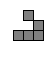

# DT508 Game Programming

Resources
---------
* [Assignments](assignment.md)
* [Webcourses](http://dit.ie/webcourses)
* [Slack](https://dt508-gameprogramming.slack.com/)
* [Processing](http://processing.org)
* [The Processing language reference](http://processing.org/reference/)
* [Learning Processing: A Beginner's Guide to Programming Images, Animation, and Interaction (Morgan Kaufmann Series in Computer Graphics)](http://http://www.learningprocessing.com/)
* [The Nature of Code](http://natureofcode.com/)
* [The git manual - read the first three chapters](http://git-scm.com/documentation)
* [A video tutorial all about git/github](https://www.youtube.com/watch?v=p_PGUltnB6w)
* [Games Fleadh](http://www.gamesfleadh.ie/)
* [The Imagine Cup](https://www.imaginecup.com/)

## Contact the lecturer
Email: bryan.duggan@dit.ie
Twitter: [@skooter500](http://twitter.com/skooter500)
Slack: https://dt508-gameprogramming.slack.com/

# Semester 2

## Week 6
- [ArrayLists in Processing](https://processing.org/reference/ArrayList.html)
- [PVectors](https://processing.org/reference/PVector.html)
- [The classes, inheritance and polymorphism example we made in the class](classes/polymorphism1)

## Lab 

### Learning Outcomes
- Explore the concepts we learned in the class this week
- Make a new classe that implement it's own methods and fields

Firstly, get the code we worked on in the class yesterday and take the time to look over it again and make sure you understand all the new keywords and concepts we have been learning. 

A particle system is a system in a computer game that keeps track of lots of small objects called particles. The particle system knows where and how to make new particles. Also, every frame in the game, the particle system is responsible for ensuring that each particle gets updated and redrawn. The updates to each particle are often implemented using physics simulation. Each particle can have forces such as gravity applied and the new positions calculated.   

Today lets have a particles jam and see what kind of crazy particle effects we can come up with.

How this should work is:

- Write down/draw
  - What the particle should look like. THis will be the code in your draw method
  - What it should do. This will be updated. For example, will it change colour, move, rotate or get bigger or smaller.
  - What fields the Particle would need to implement this.
  - What the draw method should do.
  - What the update method should do to the variables each update.
  - What causes the particle to get removed.
- Now write down
  - Where the particles are going to be emmitted from. For example, random positions, the top of the screen, the mouse position etc.
  - How often should the be emmitted. For example, 10 per second
  - How should this change over time. For example, do the new particles change colour or get bigger or whatever.

  Do all of the above before you code. I suggest form a team of up to three people for this task.

- You can start with the [code we made in the class]. Get this working and understand it!
- Comment out the code ```gameObjects.add(new Player(100, 100));```
- Create a new class called Particle that extends GameObject and implements the behaviour you worked out:
  - Make fields, and render and update method. Dont forget, you can use frameCount and the % operator to make things only happen every few frames
  - Make a constructor
  - Dont forget to include code to remove the particle

 - Now add code to the ```draw``` method of the main sketch file to get it to create the new particles. 

 This is a little one I made using stars that get created at the mouse position and move and rotate and get bigger and change colour. I didnt plan it this way, I got something working and just tinkered with it until I liked it and thats ok too.

[](https://www.youtube.com/watch?v=aBn7x2HS-2k)

 Upload pictures/videos to the Slack so I can see.

## Week 5
- [All about Inheritance please read!](https://processing.org/examples/inheritance.html)
- [Constructors](https://processing.org/examples/multipleconstructors.html)
- [Constructor chaining](http://beginnersbook.com/2013/12/java-constructor-chaining-with-example/)
- [ArrayLists in Processing](https://processing.org/reference/ArrayList.html)
- [PVectors](https://processing.org/reference/PVector.html)
- Video about inheritance and making Gameobjects in Processing:

	[](https://www.youtube.com/watch?v=5jnR-C6OqUQ)

- [The code we wrote in the class (bullets work in progress)](processing/classes2)

## Lab

### Learning outcomes
- Understand how inheritance works and when to use it
- Understand how to use constructors and constructor chaining
- Learn how to use an ArrayList
- Develop your computational thinking skills

In today's lab, we will continue to work on the program we were working on in the class yesterday and last week. First thing to do is acquire the code we worked on in the class and study it carefully. Please take the time to look at the program and understand the following:

- How the program used inheritance and what the advantage of this is
- How constructors and constructor chaining is used in the program
- How the program uses PVectors 
- How the program uses an ArrayList to keep track of all the bullets. 

I put some links to tutorials above that explain each of these features of Processing. Make sure and read them.

Now modify the program in two ways:

- You should get the bullets to be removed from the ArrayList when they go beyond the bounds of the screen. I found it useful to print out the size of the arraylist of bullets in the sketch draw method. It should be 0 initially and go up when the player presses SPACE and then go back down to 0 as the bullets go off the screen. Think carefully about where this code should go and why it should go there.
- Modify the program to limit the number of bullets you can fire to 5 bullets per second. I could tell you how to do this, but then I would rob you of the joy of figuring it for yourself :-) Your best bet is to have a think about how to do this and try a few different strategies.
- See if you can increase the speed of the bullets.

Advanced!

You could give the AI ship a "health" field and every time a bullet hits the AIship, it's health could decrease by one. Here is what the final sketch could look like:

[](https://www.youtube.com/watch?v=75uVSa8pQUc)

Some tips to help you:

To get the *current* object, use ```this````. See [this article](https://processing.org/reference/this.html)!
To remove something from an ArrayList, call ```remove``` on the ArrayList. If you get an ArrayIndexOutOfBounds exception, try changing your for loop to be something like this:

```
for (int i = bullets.size() -1 ; i >= 0  ; i --)
  {
    Bullet b = bullets.get(i);
    b.update();
    b.render(); 
```

Why will this fix the problem?

You can calculate the distance between two PVectors by calling ```PVector.dist```. For example:

```
PVector.dist(b.pos, aiShip.pos)
```

When you are done, login to webcourses and do the MCQ. Upload some pictures to the slack. It needs a splash of colour!

## Week 4
- Lecture video all about PVectors, pushMatrix, popMatrix, encapsulation, constructors, object references
 
  [](https://www.youtube.com/watch?v=XwniJyTIdec)

- [The program we wrote in the class](processing/classes)

## Lab
### Learning outcomes
- Practice creating new classes, with fields, methods and constructors.

Get the code we made yesterday in the class. You can download it [from here](processing/classes1). 

This is what your final sketch from today might look like if you get all the parts completed:

[](https://www.youtube.com/watch?v=u_cQGeBqfJk)

Study the code from yesterday and make sure you understand the following concepts:

- What a class is
- What an object (or instance of a class) is
- What fields are
- What methods are
- How to call methods and access the fields of a class
- What a constructor looks like and does
- How the ship class we made yesterday moves and rotates.

Google for tutorials if you need them.

Create a new class called AIShip with similar fields and methods to the Ship class we made yesterday. Instead of being controlled by the keyboard, the AI ship should move around the outside of the screen by itself like in the video above.

Remember! The direction of movement is controlled by the *theta* field.
Dont forget to instantiate the class and call it's methods.

Advanced:

Create a class that draws a random Star. See if you can figure out what fields it will need and what the methods should do to emulate the Stars in the video. 
Once you have one Star working, you can create an array of 5 of them. If you want to be extra ambitious, you can use an [ArrayList](https://processing.org/reference/ArrayList.html). 

- [Solution to the lab](processing/classes2)

## Week 3

### Lecture
- Hexadecimal numbers and 2's complement 
- [Lecture notes all about numbers systems & computers](https://onedrive.live.com/redir?resid=AB603D769EDBF24E!98126&authkey=!APkbdllEVMe0DLQ&ithint=file%2cppt). 
- There are lots of decimal/binary/hex converters online, [like this one](http://www.exploringbinary.com/twos-complement-converter/)

### Lab
Some 2's complement problems for you to try:

1. Convert 100 & 58 to binary.
2. Convert -58 to binary two’s compliment notation.
3. Subtract 58 from 100 using binary 2’s compliment arithmetic
4. What is 10000100 in decimal ?
5. How is 270 stored in binary ?
6. Is bit six set or cleared when 270 is stored in binary ?
7. How many bits are required to store 270 in binary ?
8. Add 13 and 6 in binary. First translate into binary.

If you haven't already tried it, try the programming task from last week. If you have completed it already, then here is a variation for you to try!

[](https://www.youtube.com/watch?v=5bNeGb0LzLk)

In this sketch we have 24 bits instead of 16 and what I have done is used the first 8 bits to represent red, the next 8 bits to represent green and the last 8 bits to represent blue. I can change the background colour by clicking on the appropriate bits. You should try last week's lab first before attempting this lab. Do try last weeks lab though. Its good for your brain. Trust me! Feel free to work in groups to figure it out.

# Week 2
## Lecture
- No class because of the strike

## Lab

For this lab you will be making a sketch that allows the user to convert between binary and decimal using a graphical tool that looks like this video (click to image to watch the video):

[](https://www.youtube.com/watch?v=GCziyTb0LF8)

The user should be able to click any one of the squares to "toggle" a bit on or off. The number in decimal should automatically change. For example, in the screenshot above, bits 0, 2 and 4 are turned on so the number is 1 + 4 + 16 = 21. 

To complete the sketch you can use a boolean array. Read  [this article that explians how arrays work in Processing](http://www.processing.org/reference/Array.html). A boolean array is just an array where every element is either true or false.

Here is a skeleton sketch to get you started if you need it, but *feel free to ignore this and just come up with your own solution*:

~~~Java
boolean[] bytes = new boolean[16];
int centX, centY;

// Probably need to declare some more variables here

void setup()
{
  size(500, 500);
  centX = width / 2;
  centY = height / 2;  
  
  // And set their values here
}


void draw()
{
  background(127);
  // Do some stuff here
  
  int number = binaryToDecimal(bytes);
  // This is how you print text in Processing
  fill(255);
  text(number, centX, 100);
}

int binaryToDecimal(boolean[] bytes)
{
  int ret = 0;

  // Implement this method
  
  return ret;
}

void mousePressed()
{
  // Put some code here too
  // To toggle the bit on or off based on the mouse position.
}
~~~

What I suggest you do is:

- Implement the method ```int binaryToDecimal(boolean[] bytes)```. 
- Set some of the bits in the bits array to be true and test the method you wrote by printing out the value.
- Write code in the ```draw()``` method to draw boxes to represent the bits. The box should be black only if the appropriate bit is true.
- Write code in the ```mousePressed()``` method to calculate which if any box the user has pressed the mouse onto and toggle the appropriate bit.

### Bonus!
- Write the decimalToBinary method that uses the divide by 2 technique to convert from a decimal number to a binary string 
- Print the bit numbers over the boxes
- Implement [2's complement](https://en.wikipedia.org/wiki/Two%27s_complement) (negative numbers).
- Colours! Lights! Animations!

# Week 1
## Lecture
- [Lecture notes all about numbers systems & computers](https://onedrive.live.com/redir?resid=AB603D769EDBF24E!98126&authkey=!APkbdllEVMe0DLQ&ithint=file%2cppt). This is a lot more information than you probably need!
- Video of the class about binary numbers:

	[](https://www.youtube.com/watch?v=obvBaoGve98)

## Lab

Bring your work on the assignment along to show me. Also here are some number theory problems you can try:

1. What is 100001000 in decimal?
2. How is 270 stored in binary?
3. Is bit six set or cleared when 270 is stored in binary? Bits are numbered from right to left starting from 0.
4. How many bits are required to store 270 in binary ?
5. Aliens have just landed in DIT. Amazingly, they use ASCII codes for representing characters, but their ship’s computers use trinary (base 3) numbers and their keyboards user pendadecimal (Base 5) characters representing 0, 1, 2,3, 4

You have received the following message from the aliens:
		
```
2222
2120
2102
2111
2120
```	
		
Decode it!

# Semester 1
# Week 1
## Lecture
- [Introduction slides](https://onedrive.live.com/redir?resid=AB603D769EDBF24E!263972&authkey=!AK1asYNZOHgqEC0&ithint=file%2cpptx)
- [The program we wrote in class](processing/intro/intro.pde)
- [The contract for this course](http://1drv.ms/1DbmnG9)
- Procedurally generated minnowforms video:

	[](https://www.youtube.com/watch?v=5G-PKD5GnlE)

- NILL - One of my game jam games. It uses lots of nice come sci stuff like Perlin noise, procedural generation and binary search

	[](https://www.youtube.com/watch?v=RkReFavQbQo)

- [NILL Sourcecode](http://github.com/skooter500/NILL)

- Some Processing assignments from previous years: 

	[](https://www.youtube.com/watch?v=S575a92AsuQ)

	[](https://www.youtube.com/watch?v=wAEABphUJB8)

##Lab
### Learning Outcomes
- Sign up for the class Slack
- Become familiar with the syntax of Processing
- Become familiar with writing and running sketches in Processing

Firstly, go to https://dt508-gameprogramming.slack.com/ and sign up for the slack with your DIT email address. When you are signed up, send a little greeting to everyone on the #general channel. If you have a smartphone, you might want to install the Slack app. It's free. Also if you install the app, you will probably want to disable certain notifications, otherwise your phone will be buzzing every time someone posts anything. [Here is an article that explains how to do this](https://slack.zendesk.com/hc/en-us/articles/201649323-Channel-and-group-notification-preferences).

Take the time to look up the following methods in the [Processing language reference](http://processing.org/reference/ ) to make sure you are clear about the syntax and parameters:

* line
* ellipse
* rect
* background
* stroke
* fill
* size

Here are two shapes you can draw:


Try experimenting with colours!

When you are finished with these exercises, [log onto webcourses](http://dit.ie/webcourses) and complete the MCQ for this week

# Week 2
## Lecture
- [Processing sketch with a face that moves from left to right and back again using the if statement](processing/leftrightface)
- Data types, the if statement and dynamic sketches in Processing video (from last year)  

  [](https://www.youtube.com/watch?v=Y0b9W3UJ2BU)

  - The best of this weeks videos (incomplete making the moving smiley face video)

 [](https://www.youtube.com/watch?v=Wr_Ev0Xqh_U)
 
## Lab
### Learning Outcomes
- Practice using variables in your sketches
- Practice using the if statement
- Practice constructing algorithms to solve problems

### Part 1
Take the smiley face program we wrote and modify it so that there are no hard-coded numbers used as parameters for any of the methods. Instead, replace them all with variables and offsets from variables. Also make the face always fill the full size of the Processing window, whatever that is set to. For example your sketch should fill the full window at 500 x500 and also at 1000 x 1000, so you have to calculate everything relative to the width and height of the window.

### Part 2
In the class we used the if statement to get the face to move from left top right across the screen and back again. Here is a [link to that sketch](processing/leftrightface). Try and modify that sketch so that the face starts in the middle of the screen and then moves around the outside of the screen. This is a little trickey to get right. You should < > in your if statement and if the face goes beyond the bounds of the window, you need to move it back inside the window. Here is a video of what your sketch should look like:

[](https://www.youtube.com/watch?v=2L1VvonXAg8)

Login to Webcourses and do the MCQ for today

- [Solution to Part 1 submitted by Tomas Ruiz Penin](processing/stretchface1)
- [Solution to part 2](processing/facearoundthewall)

# Week 3
## Lecture
- Variables & trigonometry:

  [](https://www.youtube.com/watch?v=xkK5C7Xfx80)

- [The trigonometry problem we worked on in the class](processing/kitetriangle) 

## Lab
- [Try solving some of these trigonometry problems on pen and paper](http://www.tippcityschools.com/cms/lib6/OH01000855/Centricity/Domain/111/Acc%20Geom%20eDay%201.pdf)

- Solve this trigonometry problem using pen and paper FIRST. Write a Processing sketch to solve it and draw the problem. In your solution, print the valuse for theta, o, a, and h to the screen:

	A person is standing 200m from the base of a building looking up at the top of the building through a telescope. The telescope is tilted 48 degrees off the ground. How high is the building?
	
	Important
	
	- Declare varibles for all the values you need in order to solve this problem
	- Assign values to the variables that you know
	- Calculate the values that you don't know
	- Dont forget to convert to radians before you use sin, cos, tan methods  (use the method radians)

Advanced
- Use the mouse to vary the distance of the base of the building
	
Upload images of your sketches to the slack. Log onto webcourses and complete today's MCQ

# Week 4

## Lecture

- [Program we wrote to draw a spiral](processing/spiral)
- [Program plot the sine wave](processing/sinewave)
- Making Spirals in Processing lecture:

	[](https://www.youtube.com/watch?v=wVivMDVRs3I)
 

## Lab
- Here is a little Processing sketch I wrote that does something nice with the sine wave. Click the image to see the video. I could probably do more cool stuff with it.

	[](https://www.youtube.com/watch?v=uEGCKBTZL0c)


Today we are having a Spiral Jam

- What I want you to do it:
	- Form a team of no more than three people. Just the people sitting next to you is fine! Thats how it is in the real world. You just have to work with whoever and make it work.
	- Firstly, go through the examples from the class and explain them to each other to make sure you all understand what is happening.
	- Now I want you to design a spiral or similar shape of your teams design. Just using the stuff we have learned in the class. In your spiral design, you can use
		- Variables
		- sin, cos, tan
		- angles
		- Variable operations like addition, subtraction etc 
		- Colour methods and random colours
		- line, ellipse, rect etc.
	- Before you write any code decide using pen and paper:	
		- What variables you need
		- Whether the variables should be local or global
		- What happens to the variables each frame (what operations to perform)
		- What to draw
		- What decisions your program has to make - what if statements you need
		
A gold star to the team that produces the sketch of the best design and complexity. Think simplicity in the design of your code and only use the minimum onumber of variables to solve your problem. 
		
Upload your sketches to the Slack!

# Week 5
## Lecture
- [Bugzap Code](processing/bugzap)!

- Making Bugzap in Processing Part 1

	[](https://www.youtube.com/watch?v=GSZI2TEIwa0)

- Here is a video of what the finished game looks like:

[](https://www.youtube.com/watch?v=1If-kPm6MzM)

## Lab

Complete Bugzap! When we finished up in the lecture, we had the player drawn, player movement and had started drawing the bug. To complete the game, you need to add:

- Bug drawing. This will be similar to how we drew the player
- Bug movement. This is an interesting problem. If you look at the video you will see that every bug interval, the bug moves a random offset to the left or right. Just use the random method in Processing to add to the bug's x coordinate. Make sure the bug doesn't go outside the bounds of the window. To make this happen on an interval, I used the following code:

	```C#
	if (frameCount % frame == 0)
	{
		// Move the bug
		frame --;
	}
	```
 
 ```frameCount``` is a built in variable in Processing that tells you what frame you are on. At the start of the sketch, this will be 0 and then this variable advances by 1 each frame that gets drawn. Processing looks after doing this. You don't have to worry about it. I set the value of the frame variable to be 60. The % operator is called the modulo operator and it means the remainder when frameCount is divided by frame. This will cause the code to get executed once a second. I subtract 1 from frame to cause the bug to speed up. Every time I shoot the bug, I reset this variable back to 60. See [this article for more information on the modulo operator](https://processing.org/reference/modulo.html) and how it is used.    
 
- Shooting & scoring. Just draw a line for shooting. The line should be drawn to the top of the screen, or to to the bug's Y position if we are under the bug. Use an if statement to check to see if the player is under the bug and if so, add one to the score and reset the bug's position and the frame variable. 

Advanced!
- Add a splash screen and a game over screen
- If you want to add sound effects, I made mine using [BFXR](http://www.bfxr.net/). [This tutorial]((http://code.compartmental.net/tools/minim/quickstart/) will explain how to use the Minim library to play sound effects in Processing.
- Print the score to the screen. [This tutorial](https://processing.org/tutorials/text/) explains how to print text using diffferent fonts. Alternatively, I used [this cool Processing library to draw those nice vector fonts](http://www.foobarquarium.de/blog/processing/MovingLetters/).

Upload screenshots of your sketches to the slack and log on to Webcourses and do the MCQ for today.

## Week 6
### Lecture
- [The for loop in Processing](https://processing.org/reference/for.html)

### Lab

Use the for loop to make these patterns in processing:


Add colours and invent your own designs and upload your pictures to the slack! There is no mcq today.

- [Solution to the lab](processing/flower)

## Week 7
Review week

## Week 8
### Lecture
- [Lots of loops including the clock example](processing/lotsaloops)
- Video of the lecture:

	[](https://www.youtube.com/watch?v=fcHfysgK9iw)
	
### Lab Test

#### Rules of the Test
- This is an individual test. No collaboration or communication with other students during the test.
- No use of Google/Facebook or any other external resources
- You can only access the following websites during the test: 
	- https://www.processing.org/reference/ 
	- https://github.com/skooter500/dt508-gameprogramming-2015 
- You should start the test with a blank Processing sketch
- Save OFTEN! If Processing crashes and you "loose everything" you will receive 0
- At the end of the test, zip up the folder with your solution and submit through webcourses *only*. Do not email me solutions.

### Group A

Make this in Processing:

[](https://www.youtube.com/watch?v=ETnr0A7NjMA)

The road in your sketch should fill the width of the screen. In your solution, you should create and use variables for all important pixel co-ordinates and sizes and use loops.


This is the marking scheme:

| Feature | Mark |
|---------|------|
| Drawing the road | 20 |
| Making the car move left to right | 20 |
| Making the car move right to left | 20 |
| Making the car switch between lanes | 20 |
| Code style & elegance | 20 |


### Group B

Make this in Processing:

[](https://www.youtube.com/watch?v=SGfvFkpx5eM)

The road in your sketch should fill the height of the screen. In your solution, you should create and use variables for all important pixel co-ordinates and sizes and use loops.


This is the marking scheme:

| Feature | Mark |
|---------|------|
| Drawing the road | 20 |
| Making the car move top to bottom | 20 |
| Making the car move bottom to top | 20 |
| Making the car switch between lanes | 20 |
| Code style & elegance | 20 |

- [Solution](https://github.com/skooter500/dt508_2015_labtest1)

## Week 9
### Lecture
- Methods in processing
- Video of the class:

[](https://www.youtube.com/watch?v=KInqZrmWyVI)

- [Some examples of methods in Processing](processing/methods1)

### Lab
Write and call the following methods in Processing

- A method that takes 3 float parameters and returns the minimum of the three parameters
- A method called circleArea that takes the radius of a circle and returns the area of the circle

Now take the [solution to the lab test](https://github.com/skooter500/dt508_2015_labtest1) and refactor it to use methods. I suggest you add the following methods:

- ```drawCar(float x, float y, float l, float w)``` Take the car drawing code from the draw method and move it into this method. Use the x and y parameters to control where the car is drawn. The parameters l and w should control the length and the width of the car. For an additional challenge, draw wheels on the car.

- ```drawRoad(float y, float w)``` Take the road drawing code from the draw method and move it into this method. The parameter y should control the center of the road and w should control the width of the car. 

Advanced!

- Write a method ```drawPolygon(float cx, float cy, float radius, float sides)``` Calling this method as follows:

	```drawPolygon(100, 100, 50, 5)```
	
	will draw:
	
		
	
- Write a method ```drawStar(float cx, float cy, float radius, float points)```
	
Put screenshots of your sketches on slack and do the MCQ for today

# Week 10
## Lecture
- [Arrays in Processing tutorial](https://processing.org/tutorials/arrays/)
- [Arrays program we wrote on the class](processing/arrays)
- Video of the class:

	[](https://www.youtube.com/watch?v=cMWxN4j30A0)

## Lab
### Learning outcomes
- Learn how tio allocate arrays
- Learn how to store values in arrays
- Practice iterating arrays

Here is the rainfall data recorded at the Dublin Airport over 12 months of 2010:

| Month | Amount in mm |
|-------|--------------|
| Jan | 45 |
| Feb | 37 |
| March | 55 |
| April | 27 |
| May | 38 |
| June | 50 |
| July | 79 |
| August | 48 |
| September | 104 |
| October | 31 |
| November | 100 |
| December | 58 |

Create a Processing sketch and do the following:

- Allocate two arrays for storing the month names and the rainfall data
- Calculate the average rainfall for that year
- Calculate the month with the highest rainfall
- Calculate the month with the lowest rainfall

Now see if you can write code to generate the following graphs of the rainfall data:

- A bar chart:

	
	
- A trend line:

	
	
Advanced:
	
Try and draw a pie chart!	
	
Hint! for the bar chart, it might be useful to allocate a third array to hold the colours. Youc an use random colours so that every month has a different colour.

Upload screenshots of your sketches to slack and do the MCQ for today. 

# Week 11
## Lecture
- [Conway's Game of Life Wiki](http://www.conwaylife.com/wiki/Main_Page)
- Video of the class:

[](https://www.youtube.com/watch?v=-3yAOgmtC-s)

- Epic Conway's Game of Life:

[](https://www.youtube.com/watch?v=C2vgICfQawE)

- [The code we wrote in the class](processing/life1)

## Lab

Lets play with the Game of Life code we wrote in the class yesterday. We will finish off the Game of Life in class together on Monday, but feel free to [read the wiki](https://en.wikipedia.org/wiki/Conway%27s_Game_of_Life) and figure it out for yourself if you like.

Today there are a few simple changes we can make...

- Try and figure out the ```countLiveCells``` method. Finish it off and most importantly, set some cells to be true (in the 2D array) and then test the method by passing in some row and col values and making sure you get the right count back. In other words, do the calculation yourself and then make sure the meothd returns the correct count.
- The method ```void mousePressed()``` gets called in your sketch whenever the mouse is pressed. The method ```mouseDragged``` gets called whenever you hold the mouse down and move it over your sketch. You can get the mouse x and y coordinates by using the built in variables ```mouseX``` and ```mouseY```. You can use these methods to implement mouse drawing. To do this you need to calculate which row and column in the 2D array the mouse is over and then set this cell to be true. 
- When you press the c key, the board should clear. In otherwords, you should set every element in th 2D array to be false.
- When you press the r key, you should randomly set 50% of the elements to be true. To do this, you need to iterate through the array and generate a random number between 0.0f and 1.0f. If the number is > 0.5f, you set the element to be true otherwise set it to be false.   

There some interesting starting patterns you can program also. You could write code so that when you press a number key it creates the starting pattern at the mouse x and y. I used the mouse x and y to be the top left of the shape.

| Pattern | Description |
|---------|-------------|
| | Gosper Gun |
| | Lightweight spaceship |
| | Tumbler |
| | Glider |
| | I'm not sure what this is called, but it makes amazing patterns |

Here is a video of what my sketch looks like:

[](https://www.youtube.com/watch?v=72X38iT74As) 

Upload your sketches to the slack! There may be an MCQ

# Week 12
## Lecture
- [Pong work in progress from Monday's class](processing/pong)

## Lab
- Complete Pong
- [Read over the assignment brief for the Christmas assignment](assignment.md)
- [Please give me some feedback on this semester](https://docs.google.com/forms/d/1MsU9X1XX1x0qaAvqxWyAcNyEeMuRyzuBVcPg7YP7YOU/viewform)